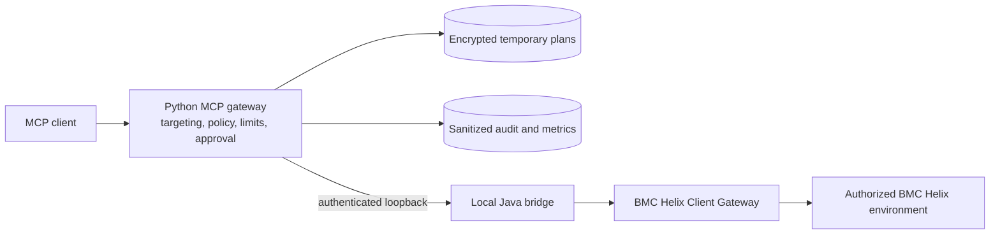

# Helix MCP Gateway

[](https://github.com/hvolckaert/helix-mcp-gateway/actions/workflows/ci.yml)
[](https://github.com/hvolckaert/helix-mcp-gateway/releases)
[](LICENSE)

[Español](docs/README.es.md)

**Policy-controlled MCP access to BMC Helix through the AR API.**

Helix MCP Gateway is an independent local MCP server that enables authorized
AI agents to interact with BMC Helix through the AR API. It provides bounded
reads, reviewable SQL, and human-approved write workflows across DEV, QA, and
PROD without redistributing proprietary BMC libraries.

The gateway is designed for BMC Helix professionals who already have an
authorized local runtime. It is not a hosted service and does not bypass the
permissions of the Helix account.

## Why it exists

Giving an AI agent direct, unrestricted access to an enterprise service
management platform is unsafe. This gateway places explicit policy and review
boundaries between the agent and Helix:

- every operation selects `dev`, `qa`, or `prod` explicitly;
- form and field access is constrained by policy;
- SQL is read-only, allowlisted, bounded, and executed only after review;
- creates and updates use a mandatory plan/review/apply workflow;
- every environment starts read-only and may enable controlled writes through
  its explicit policy;
- audit, metrics, and public errors exclude arguments and business payloads.

Deletion, attachments, bulk writes, and direct database connections are not
exposed.

## Architecture



The Python process communicates with a managed Java bridge over loopback. A
persisted installation derives a domain-separated bridge token from its
private plan key, allowing its local dashboard and MCP processes to reuse the
same authenticated bridge. Stateless instances use an ephemeral token. Bridge
identity is verified with an HMAC challenge before credentials are sent. The
bridge uses the official AR API libraries already installed on the user's
machine. Those proprietary libraries are never copied into this repository,
the wheel, or a GitHub release.

## Why AR API instead of REST only?

The gateway deliberately uses the official BMC AR System Java API as its
integration boundary. This allows it to reuse an authorized local Developer
Studio installation, Client Gateway routing, and the permissions of the
selected Helix account for form metadata, bounded reads, controlled writes,
and administrator-only SQL through AR API.

This is not a claim that REST is unsuitable. It is an architectural choice for
teams that already operate the AR API runtime and need those capabilities
behind one policy and approval layer. The gateway never connects directly to
the database, and the user-supplied proprietary BMC libraries remain local.

## Capabilities

The server exposes 19 MCP tools:

| Area | Tools | External effect |
| --- | --- | --- |
| Targets and health | `list_targets`, `health_check` | Local catalog and bounded connectivity probes |
| Form reads | `list_forms`, `list_form_fields`, `query_form`, `get_entry` | Policy-filtered metadata and bounded records |
| Database metadata | `list_database_objects`, `list_database_columns`, `describe_database_object` | Administrator-only catalog reads through AR API |
| Read-only SQL | `plan_sql_query`, `get_sql_query_plan`, `execute_sql_query`, `cancel_sql_query_plan` | Reviewable, bounded, single-use SQL execution |
| Controlled writes | `plan_create_entry`, `apply_create_entry`, `plan_update_entry`, `apply_update_entry` | Human-approved single-entry creates and updates |
| Write-plan lifecycle | `get_write_plan`, `cancel_write_plan` | Inspection or cancellation of temporary plans |

See the complete [MCP tool catalog](docs/mcp-tools.md).

## Security model

- The effective BMC permissions always come from the selected Helix account.
- Configuration policies can reduce those permissions but cannot expand them.
- SQL execution and database metadata require an AR System administrator
  account.
- Write plans bind the environment, form, values, reason, and precondition to
  a digest that must be supplied during the later apply call.
- Interrupted writes become `outcome_unknown` and are never retried
  automatically.
- Optional persistent plans are encrypted with AES-256-GCM using a separate
  local key.
- Logs and audit records use closed schemas and omit tool arguments, SQL,
  credentials, form values, and returned rows.

Read [SECURITY.md](SECURITY.md) and the
[observability contract](docs/observability.md) before using the gateway with
a real environment.

## Requirements

- Python 3.12;
- a Java 17 or later JDK with the required compiler modules;
- an authorized BMC Developer Studio / AR System Java API installation;
- a configured local BMC Helix Client Gateway connection to the permitted
  Helix environments;
- authorized per-environment credentials.

The exact supported setup and its current limitations are documented in
[Installation](docs/installation.md).

## Quick start

Install a verified release wheel in a virtual environment, then run guided
setup and preflight with explicit paths:

```text
python3.12 -m venv /path/to/helix-mcp/venv
/path/to/helix-mcp/venv/bin/python -m pip install /path/to/release.whl
/path/to/helix-mcp/venv/bin/helix-mcp-setup \
  --arapi-lib-dir "/authorized/path/to/DeveloperStudio/lib"
/path/to/helix-mcp/venv/bin/helix-mcp-check \
  --dotenv /path/returned/by/setup/.env \
  --live \
  --environment dev
```

The setup command generates local configuration, compiles the Java bridge
against the user's AR API installation, and creates the encryption key when
requested. It never overwrites existing credentials or configuration. After a
successful installation it installs a persistent per-user dashboard service,
starts it, and opens it in the default browser. Setup also creates stable MCP
and dashboard launchers; clients and the dashboard service keep those commands
while managed updates switch the validated runtime behind them. By default,
setup detects an available OpenClaw command, registers the MCP launcher and
verifies its tool catalog automatically.
Use `--client standalone` when another MCP client will own the integration.

The dashboard remains available on `http://127.0.0.1:8766/` independently of
the MCP process and is restored across supported user-session restarts. It
edits the fixed DEV, QA, and PROD access policies, configures
the loopback AR API bridge, discovers selectable form and field metadata,
replaces credentials without reading them back, and runs sanitized readiness
checks. It can check GitHub releases and, after explicit confirmation, install
a verified release into an isolated runtime with backup and rollback. Saving is
validated and atomic. OpenClaw-managed installations reload their cached MCP
runtime automatically after a save; other clients must reconnect their own
stdio process before using configuration changes.
Use `helix-mcp-setup --no-dashboard` to keep the dashboard service available
without opening a browser during headless or unattended setup.

When OpenClaw is not selected, register the absolute stable MCP command returned
by setup with the client.
The complete verified workflow is in
[Installation](docs/installation.md).

### MCP client configuration

Setup returns the absolute stable launcher for the installation. A generic
client entry looks like this:

```json
{
  "mcpServers": {
    "helix": {
      "command": "/path/to/per-user/data/helix-mcp/bin/helix-mcp",
      "args": []
    }
  }
}
```

Use the exact launcher returned by setup; native Windows uses its returned
`.cmd` path. The stable launcher keeps client configuration unchanged across
managed updates.

For development from a checkout:

```text
python3.12 -m venv .venv
.venv/bin/python -m pip install -e ".[test]"
.venv/bin/python -m pytest -q
sh arapi-bridge/test.sh
```

Automated tests use fictional in-memory data and do not require access to BMC
Helix. Live tests are opt-in and must use an explicitly authorized target.

## Demonstrations

- [CMDB data-quality analysis](docs/use-cases/cmdb-data-quality.md): discover
  an authorized synthetic model, review a bounded read-only SQL plan, and
  explain relationship and freshness findings without modifying Helix.
- [Integrated Knowledge/Gateway CMDB case](https://github.com/hvolckaert/helix-mcp-knowledge/blob/main/docs/integrated-cmdb-data-quality-case.md):
  combine versioned documentary evidence with the approved synthetic DEV read
  while keeping observations and inferences separate.
- [Controlled form update](docs/use-cases/controlled-form-update.md): stage one
  synthetic DEV update, require approval in a later turn, verify the result,
  and demonstrate a form-level PROD policy boundary.

Short sanitized video versions are planned. The written cases contain the
reproducible prompts, approval boundaries, results, and limitations today.

## Limitations

- Live operation requires user-supplied BMC AR API libraries, Client Gateway
  connectivity, and authorized credentials.
- The complete installation has been validated on Ubuntu under WSL2. Native
  Windows is documented but not yet fully validated; macOS is not validated.
- Database metadata and SQL require an AR System administrator account.
- Generic stdio clients must reconnect after configuration changes. Managed
  OpenClaw installations are reloaded automatically by the dashboard.
- Deletion, attachments, bulk writes, direct database access, and autonomous
  remediation are intentionally outside the exposed tool surface.
- The current release is intended for controlled evaluation, not unattended
  production automation.

See the [compatibility matrix](docs/compatibility.md) and the detailed
[installation limitations](docs/installation.md) before adopting the gateway.

## Project status

The project is under active development. The current release line is suitable
for controlled evaluation by qualified BMC Helix professionals. Test the exact
policy against a non-production environment before enabling any write scope.

## Roadmap

- complete and document a full native Windows installation validation;
- expand public evidence for additional MCP clients and supported platforms;
- publish sanitized recordings of the two reproducible use cases;
- incorporate external feedback while preserving the explicit policy,
  approval, and audit boundaries.

## Documentation

- [Documentation index](docs/README.md)
- [Installation](docs/installation.md)
- [Compatibility matrix](docs/compatibility.md)
- [Troubleshooting](docs/troubleshooting.md)
- [Configuration](docs/configuration-loading.md)
- [Local configuration dashboard](docs/dashboard.md)
- [Operations](docs/operations.md)
- [MCP tools](docs/mcp-tools.md)
- [Form reads](docs/form-query-service.md)
- [Human-approved writes](docs/form-writes.md)
- [SQL through AR API](docs/sql.md)
- [Development and testing](docs/development.md)

## Contact and support

- Use [GitHub Issues](https://github.com/hvolckaert/helix-mcp-gateway/issues)
  for sanitized bug reports, feature proposals, and support requests.
- Read [CONTRIBUTING.md](CONTRIBUTING.md) before proposing a significant
  change.
- Report vulnerabilities only through the private process in
  [SECURITY.md](SECURITY.md).
- Maintainer: [Hugo Volckaert](https://github.com/hvolckaert).

Never include credentials, private endpoints, organization names, private form
or field names, SQL, record values, or raw diagnostics in a public issue.

## License and trademarks

Original project code is available under the [MIT License](LICENSE). BMC
software and libraries are not included and are governed by their respective
licenses.

This is an independent project. It is not affiliated with, sponsored by, or
endorsed by BMC Software, Inc. BMC, BMC Helix, and related product names are
trademarks of their respective owners.
