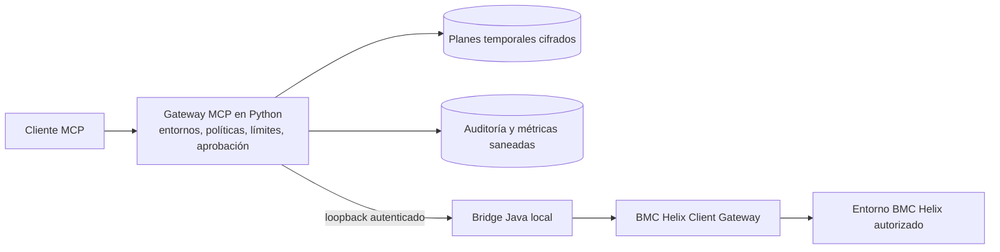

# Helix MCP Gateway

[](https://github.com/hvolckaert/helix-mcp-gateway/actions/workflows/ci.yml)
[](https://github.com/hvolckaert/helix-mcp-gateway/releases)
[](../LICENSE)

[English](../README.md)

**Acceso MCP a BMC Helix controlado mediante políticas y ejecutado a través de
AR API.**

Helix MCP Gateway es un servidor MCP local e independiente que permite a
agentes de IA autorizados interactuar con BMC Helix mediante AR API. Ofrece
lecturas acotadas, SQL revisable y operaciones de escritura con aprobación
humana en DEV, QA y PROD, sin redistribuir librerías propietarias de BMC.

Está dirigido a profesionales de BMC Helix que ya disponen de un entorno local
autorizado. No es un servicio alojado y no elude los permisos de la cuenta de
Helix.

## Qué problema resuelve

Dar acceso directo e ilimitado a una plataforma de gestión empresarial resulta
inseguro. El gateway sitúa límites explícitos entre el agente y Helix:

- cada operación selecciona `dev`, `qa` o `prod` expresamente;
- el acceso a formularios y campos está limitado por políticas;
- SQL es de solo lectura, está acotado y necesita revisión previa;
- las altas y actualizaciones siguen un flujo obligatorio de plan, revisión y
  aplicación;
- cada entorno comienza en solo lectura y puede habilitar escrituras
  controladas mediante su política;
- la auditoría, las métricas y los errores públicos excluyen argumentos y
  datos de negocio.

No se exponen eliminaciones, adjuntos, escrituras masivas ni conexiones
directas a la base de datos.

## Arquitectura



El proceso Python se comunica con un bridge Java gestionado en loopback. La
instalación persistente deriva un token específico del bridge a partir de su
clave privada de planes, lo que permite reutilizar el mismo bridge desde el
dashboard y los procesos MCP. La identidad se verifica antes de enviar
credenciales.

El bridge emplea las librerías oficiales de AR API ya instaladas por el
usuario. Esas librerías no se incluyen en el repositorio, la distribución ni
las releases de GitHub.

## Por qué AR API y no únicamente REST

AR API es deliberadamente la frontera de integración del proyecto. Permite
reutilizar una instalación local autorizada de Developer Studio, el enrutado
del Client Gateway y los permisos de la cuenta seleccionada para consultar
metadatos, realizar lecturas acotadas, ejecutar escrituras controladas y, con
una cuenta administradora, realizar consultas SQL a través de AR API.

Esto no significa que REST sea inadecuado. Es una decisión arquitectónica para
equipos que ya operan el runtime de AR API y necesitan esas capacidades detrás
de una única capa de políticas y aprobación. El gateway nunca conecta
directamente con la base de datos.

## Herramientas disponibles

El servidor expone 19 herramientas MCP:

| Área | Herramientas | Efecto externo |
| --- | --- | --- |
| Entornos y salud | `list_targets`, `health_check` | Catálogo local y comprobaciones acotadas de conectividad |
| Lectura de formularios | `list_forms`, `list_form_fields`, `query_form`, `get_entry` | Metadatos filtrados y registros acotados |
| Metadatos de base de datos | `list_database_objects`, `list_database_columns`, `describe_database_object` | Lecturas administrativas del catálogo mediante AR API |
| SQL de solo lectura | `plan_sql_query`, `get_sql_query_plan`, `execute_sql_query`, `cancel_sql_query_plan` | SQL revisable, acotado y de un solo uso |
| Escrituras controladas | `plan_create_entry`, `apply_create_entry`, `plan_update_entry`, `apply_update_entry` | Altas y actualizaciones de un registro con aprobación humana |
| Ciclo de planes | `get_write_plan`, `cancel_write_plan` | Consulta o cancelación de planes temporales |

Consulta el [catálogo completo](mcp-tools.md) para conocer argumentos, límites,
riesgo y permisos administrativos.

## Modelo de seguridad

- Los permisos efectivos proceden siempre de la cuenta seleccionada de BMC.
- Las políticas pueden reducir esos permisos, pero nunca ampliarlos.
- Los metadatos de base de datos y SQL requieren una cuenta administradora de
  AR System.
- Los planes de escritura vinculan entorno, formulario, valores, motivo y
  precondición a un digest que debe enviarse al aplicar la operación.
- Las escrituras interrumpidas pasan a `outcome_unknown` y nunca se reintentan
  automáticamente.
- Los planes persistentes se cifran con AES-256-GCM mediante una clave local
  independiente.
- Logs y auditoría usan esquemas cerrados y omiten argumentos, SQL,
  credenciales, valores de formularios y filas devueltas.

Lee la [política de seguridad](../SECURITY.md) y el
[contrato de observabilidad](observability.md) antes de utilizar el gateway con
un entorno real.

## Requisitos

- Python 3.12;
- JDK 17 o posterior con los módulos de compilación necesarios;
- una instalación autorizada de BMC Developer Studio o AR System Java API;
- BMC Helix Client Gateway local configurado para los entornos permitidos;
- credenciales autorizadas para cada entorno.

Las combinaciones probadas y sus limitaciones figuran en la
[matriz de compatibilidad](compatibility.md).

## Instalación rápida

Instala una wheel verificada en un entorno virtual y ejecuta la configuración
guiada y el preflight con rutas explícitas:

```text
python3.12 -m venv /ruta/a/helix-mcp/venv
/ruta/a/helix-mcp/venv/bin/python -m pip install /ruta/a/release.whl
/ruta/a/helix-mcp/venv/bin/helix-mcp-setup \
  --arapi-lib-dir "/ruta/autorizada/a/DeveloperStudio/lib"
/ruta/a/helix-mcp/venv/bin/helix-mcp-check \
  --dotenv /ruta/devuelta/por/setup/.env \
  --live \
  --environment dev
```

La configuración genera los archivos locales, compila el bridge contra la
instalación AR API del usuario y arranca el dashboard persistente. También crea
lanzadores estables para que las actualizaciones gestionadas no obliguen a
cambiar la configuración del cliente MCP.

Si OpenClaw está disponible, la instalación lo detecta, registra el gateway y
verifica el catálogo de herramientas. Utiliza `--client standalone` cuando la
integración pertenezca a otro cliente.

El dashboard se mantiene disponible en `http://127.0.0.1:8766/`. Permite editar
las políticas fijas de DEV, QA y PROD, seleccionar formularios y campos,
reemplazar credenciales sin leerlas de vuelta, ejecutar comprobaciones saneadas
y aplicar releases verificadas con copia de seguridad y rollback.

### Configuración del cliente MCP

La instalación devuelve la ruta absoluta del lanzador estable. Una entrada
genérica es:

```json
{
  "mcpServers": {
    "helix": {
      "command": "/ruta/a/datos/de/usuario/helix-mcp/bin/helix-mcp",
      "args": []
    }
  }
}
```

Debe utilizarse exactamente el lanzador devuelto. En Windows nativo será una
ruta `.cmd`. Los clientes stdio genéricos deben reconectarse después de un
cambio de configuración; el dashboard recarga automáticamente las
instalaciones gestionadas por OpenClaw.

Consulta la [guía de instalación completa](installation.md) para el proceso
verificado.

## Demostraciones

- [Análisis de calidad de CMDB](use-cases/cmdb-data-quality.md): descubre un
  modelo sintético autorizado, revisa un plan SQL acotado y explica incidencias
  de relaciones y frescura sin modificar Helix.
- [Actualización controlada](use-cases/controlled-form-update.md): prepara una
  actualización sintética en DEV, exige aprobación en un turno posterior,
  verifica el resultado y demuestra un límite de escritura por formulario en
  PROD.

Los vídeos breves y saneados están planificados. Los casos escritos ya contienen
los prompts reproducibles, controles de aprobación, resultados y limitaciones.

## Limitaciones

- La operación real depende de librerías AR API aportadas por el usuario,
  Client Gateway y credenciales autorizadas.
- La instalación completa se ha validado en Ubuntu bajo WSL2. Windows nativo
  está documentado, pero no validado por completo; macOS no está validado.
- Los metadatos de base de datos y SQL requieren una cuenta administradora.
- No se exponen eliminaciones, adjuntos, escrituras masivas, acceso directo a
  base de datos ni remediación autónoma.
- La release actual está pensada para evaluación controlada, no para
  automatización desatendida en producción.

## Documentación

- [Índice de documentación](README.md)
- [Instalación](installation.md)
- [Dashboard local](dashboard.md)
- [Operación](operations.md)
- [Herramientas MCP](mcp-tools.md)
- [Lectura de formularios](form-query-service.md)
- [Escrituras con aprobación humana](form-writes.md)
- [SQL mediante AR API](sql.md)
- [Resolución de problemas](troubleshooting.md)

## Estado del proyecto

El proyecto está en desarrollo activo. La release actual es adecuada para una
evaluación controlada por profesionales cualificados de BMC Helix. Antes de
habilitar escrituras, debe probarse la política exacta en un entorno no
productivo.

## Hoja de ruta

- completar y documentar una instalación íntegra en Windows nativo;
- ampliar la evidencia pública para otros clientes MCP y plataformas;
- publicar grabaciones saneadas de los dos casos reproducibles;
- incorporar feedback externo manteniendo los límites de política, aprobación
  y auditoría.

## Contacto y soporte

- Utiliza [GitHub Issues](https://github.com/hvolckaert/helix-mcp-gateway/issues)
  para incidencias, propuestas y solicitudes de soporte saneadas.
- Lee [CONTRIBUTING.md](../CONTRIBUTING.md) antes de proponer cambios
  significativos.
- Comunica vulnerabilidades exclusivamente mediante el proceso privado de
  [SECURITY.md](../SECURITY.md).
- Mantenedor: [Hugo Volckaert](https://github.com/hvolckaert).

Nunca incluyas credenciales, endpoints privados, nombres de organizaciones,
nombres privados de formularios o campos, SQL, valores de registros ni
diagnósticos brutos en una incidencia pública.

## Licencia y marcas

El código original del proyecto se distribuye bajo la
[licencia MIT](../LICENSE). El software y las librerías de BMC no están
incluidos y se rigen por sus respectivas licencias.

Este es un proyecto independiente, no afiliado, patrocinado ni respaldado por
BMC Software, Inc. BMC, BMC Helix y los nombres de productos relacionados son
marcas de sus respectivos propietarios.
