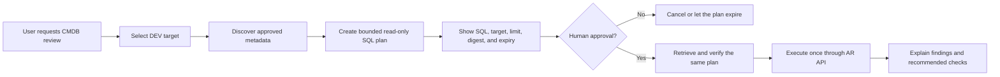

# CMDB data quality with human-approved SQL

This case study shows how an AI agent can investigate CMDB quality through
Helix MCP Gateway without receiving unrestricted database access or permission
to modify configuration items.

The
[integrated Knowledge/Gateway case](https://github.com/hvolckaert/helix-mcp-knowledge/blob/main/docs/integrated-cmdb-data-quality-case.md)
adds versioned BMC documentary evidence, an explicit two-turn approval boundary,
and a common evidence ledger to this live-data workflow.

The workflow was validated against an authorized synthetic dataset in a DEV
environment. The public description contains no customer records, private
schema extensions, credentials, endpoints, entry identifiers, or raw query
results.

## Scenario

A CMDB specialist wants to review computer systems and their related operating
systems. The objective is to identify data that may require investigation:

- duplicate computer-system names;
- systems without an operating-system relationship;
- systems with multiple operating-system relationships;
- operating systems whose version information is missing;
- systems that have not been scanned within an agreed period.

The validated synthetic scope contained seven computer systems, seven
operating systems, and seven relationships. All five finding categories were
represented deliberately so that the demonstration produces an explainable,
repeatable result.

## Controlled workflow

The planning turn and execution turn are intentionally separate. Approval is
bound to the exact environment, SQL text, result limit, digest, and expiry. A
changed, expired, cancelled, or previously executed plan cannot be substituted
silently.

## Reproducible prompt

The physical forms, database views, fields, and dataset selector must be mapped
privately for each authorized installation. Once that mapping exists, the
following prompt can drive the demonstration:

> Analyze CMDB data quality in the authorized synthetic DEV scope. Verify only
> the metadata needed to relate computer systems to operating systems. Use the
> deployment's logical-deletion field rather than a generic request-status
> field when deciding whether a CI or relationship is active. Prepare one
> read-only SQL plan, limited to 20 rows, that reports a presentation-safe
> system name, last scan time, number of active operating-system relationships,
> related operating-system names, and whether OS version information is
> missing. Show the exact SQL, target, limit, plan ID, digest, and expiry, then
> stop and wait for explicit human approval. After approval, retrieve and
> verify that same pending plan, execute it once, and report duplicate names,
> systems without an OS, systems with multiple OS relationships, missing OS
> versions, and systems not scanned within 90 days. Do not create, update, or
> delete any Helix record.

The agent should not invent physical names or reuse the mapping from another
installation. Metadata discovery and policy remain specific to the selected
target.

## Tools used

| Stage | MCP tool | Purpose |
| --- | --- | --- |
| Target selection | `list_targets` | Confirm the explicit DEV target and its effective capabilities |
| Readiness | `health_check` | Verify the local bridge and authorized connectivity |
| Form discovery | `list_forms`, `list_form_fields` | Validate the minimum form and field mapping |
| Database discovery | `list_database_objects`, `list_database_columns` | Validate approved SQL objects and columns through AR API |
| Planning | `plan_sql_query` | Store the exact bounded read-only query for review |
| Approval review | `get_sql_query_plan` | Retrieve the unchanged pending plan after approval |
| Execution | `execute_sql_query` | Execute that plan once and return bounded positional results |

Database discovery and SQL execution require an AR System administrator
account. Form discovery remains available to non-administrator accounts when
permitted by the Helix account and gateway policy.

## Validated outcome

The final approved query returned seven rows with a limit of 20 and reported
that the result was not truncated. It supported the following conclusions:

| Finding | Interpretation |
| --- | --- |
| Duplicate presentation name | Review whether two records represent the same CI or need a stronger identity rule |
| No operating-system relationship | Check discovery, normalization, and relationship-generation coverage |
| Multiple operating-system relationships | Confirm whether the model permits the combination or contains stale relationships |
| Missing OS version | Review source completeness and normalization rules |
| Scan older than 90 days | Confirm whether the CI is inactive, unreachable, or no longer discovered |

These are investigation candidates, not automatic diagnoses. The gateway does
not remediate, merge, delete, or update any CI as part of this case.

## Manual process compared with the assisted process

| Activity | Typical manual approach | Gateway-assisted approach |
| --- | --- | --- |
| Discover the model | Inspect forms, fields, and database views separately | Agent gathers bounded metadata through named tools |
| Build the analysis | Write and revise a query in an administrative client | Agent prepares one policy-checked query plan |
| Review risk | Rely on operator discipline and client permissions | Exact SQL, target, limit, digest, and expiry are presented together |
| Run the query | Execute from the database or an administrative console | Approved SQL runs through AR API with the existing Helix identity |
| Interpret output | Manually correlate counts, relationships, and dates | Agent groups findings and proposes follow-up checks |
| Retain evidence | Capture screenshots or export data manually | Closed-schema audit records the operation without SQL or returned rows |

The value is not merely faster query generation. It is a repeatable boundary
between natural-language analysis, existing Helix permissions, gateway policy,
and an explicit human decision.

## Security controls demonstrated

- Every call names `dev` explicitly; there is no implicit environment.
- Form and SQL object access remain constrained by target policy.
- SQL is SELECT-only, uses explicit output aliases, and has a bounded result.
- Planning performs no SQL call and does not prove administrator permission.
- Execution requires the exact pending plan ID and digest after human approval.
- The Java bridge repeats SELECT-only validation before calling AR API.
- The underlying Helix account remains the effective permission boundary.
- Audit and metrics omit SQL text, literals, business values, and returned rows.
- No write, attachment, deletion, or direct database connection is exposed.

## Limitations

- The validation used a small synthetic dataset, not a production-quality
  benchmark.
- Each installation needs an authorized private mapping of its CMDB forms,
  views, fields, dataset, relationship direction, and lifecycle semantics.
- SQL and database metadata depend on AR System administrator permission.
- Database behavior can vary across Helix releases. The validated
  demonstration uses a flat SELECT with joins and does not claim general CTE
  or window-function compatibility.
- A finding still requires review by a CMDB specialist before remediation.
- Helix MCP Gateway can reduce account permissions through policy but cannot
  grant permissions the account does not already have.

## Safe reproduction checklist

1. Create or obtain an explicitly authorized synthetic DEV dataset.
2. Exclude people, locations, network addresses, serial numbers, customer
   extensions, credentials, and free text from the public result.
3. Confirm the relationship direction and logical-deletion semantics through
   metadata and a bounded read.
4. Configure the minimum required form and SQL scopes in the dashboard.
5. Run preflight and verify the effective target capabilities.
6. Prepare the plan, display it, and end the turn.
7. Execute only after explicit approval in a later turn.
8. Sanitize screenshots and narrative independently of raw runtime output.

For the complete tool and security contracts, see
[`mcp-tools.md`](../mcp-tools.md), [`sql.md`](../sql.md), and
[`observability.md`](../observability.md).
