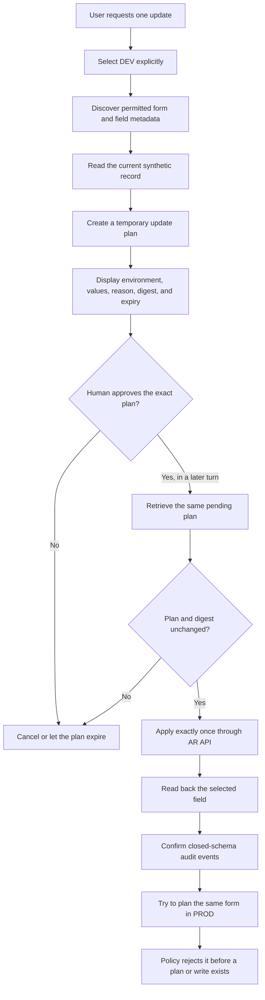

# Controlled Helix update with explicit human approval

This case study shows how an AI agent can update one authorized Helix record
without receiving unrestricted write access. The operation is discovered,
planned, reviewed, approved, executed once, verified, and audited through
Helix MCP Gateway.

The workflow was validated with a fictional record in a DEV environment. This
public description omits the installation's physical form name, entry
identifier, private schema extensions, credentials, endpoints, and raw tool
results.

## Scenario

An operator asks the agent to add a fictional assignment marker to an
authorized synthetic configuration item. The selected field is initially
empty, is classified as non-sensitive, and is explicitly writable in DEV.

The same form is not included in PROD's write scope. PROD can still permit
controlled writes to other explicitly configured forms; the demonstration
therefore proves a form-level boundary rather than relying on a globally
read-only production environment.

## Approval flow

The planning and execution turns are deliberately separate. Approval is bound
to one environment, operation, form, entry, set of proposed values, reason,
digest, and expiry. The gateway cannot silently replace the reviewed plan with
a different operation.

## Reproducible prompt

Each installation must privately select its own authorized synthetic form,
record, and non-sensitive field. After that mapping has been reviewed, the
following prompt can drive the DEV portion of the demonstration:

> Update one authorized synthetic record in DEV by setting the selected
> non-sensitive demonstration field to its agreed fictional value. Discover
> or verify only the required form and field metadata, read the current value,
> and prepare an update plan with a clear reason. Show the exact environment,
> form, entry identifier, current and proposed values, reason, plan ID, digest,
> and expiry. Then stop and wait for my explicit approval. In a later turn,
> retrieve the same plan, verify that it is still pending and unchanged,
> execute it exactly once, read the field back, and summarize the audit result.
> Do not create a replacement plan after approval and do not modify any other
> record or environment.

Physical names and values should remain in private demonstration notes. They
must not be copied from another installation or invented by the agent.

## Tools used

| Stage | MCP tool | Purpose |
| --- | --- | --- |
| Target selection | `list_targets` | Confirm explicit environments and effective high-level capabilities |
| Readiness | `health_check` | Verify the local bridge and authorized DEV connectivity |
| Discovery | `list_forms`, `list_form_fields` | Confirm the permitted form and non-sensitive field |
| Current state | `query_form` | Select one synthetic record and read its current value |
| Planning | `plan_update_entry` | Validate policy and store the exact temporary operation |
| Approval review | `get_write_plan` | Retrieve the unchanged pending plan in the approval turn |
| Execution | `apply_update_entry` | Apply the approved update once through AR API |
| Verification | `query_form` | Confirm the resulting field value with a bounded read |

## Validated result

The DEV plan was presented in one turn and explicitly approved in a later
turn. Before execution, the gateway returned the same pending plan and digest.
The operation then completed with `status=applied` and
`reused_result=false`. A bounded read confirmed the fictional value on the
single selected record.

The corresponding PROD planning request was rejected with
`FORM_WRITE_FORM_NOT_ALLOWED`. No PROD plan was created and no PROD record was
read or modified as part of that attempt.

## What the audit proves

The closed-schema audit recorded separate events for:

- plan creation;
- plan retrieval after approval;
- successful application in DEV;
- bounded verification read;
- rejected PROD planning.

Each event records operational metadata such as the tool, operation kind,
environment, outcome, duration, and a random operation identifier. It does not
record form names, entry identifiers, proposed values, returned records, SQL,
credentials, or business data.

## Manual process compared with the assisted process

| Activity | Typical manual approach | Gateway-assisted approach |
| --- | --- | --- |
| Find the target | Open an administrative client and locate a record | Agent performs a bounded policy-filtered read |
| Prepare the change | Edit the field directly | Agent creates a non-mutating temporary plan |
| Review the action | Rely on a final visual check | Exact target, values, reason, digest, and expiry are reviewed together |
| Authorize execution | Client access often implies immediate write access | A later explicit human approval is required |
| Prevent substitution | Trust the operator to preserve the intended values | Digest and stored plan bind execution to the reviewed operation |
| Verify and retain evidence | Reopen the record and collect screenshots or logs | Agent reads back the field and the gateway writes a sanitized audit event |
| Protect production | Depend on account discipline or a globally read-only account | Per-form policy rejects this operation while other approved PROD writes remain possible |

## Security controls demonstrated

- Every operation names `dev` or `prod` explicitly.
- The Helix account remains the upper permission boundary.
- Gateway policy can reduce access by form and field but cannot grant missing
  Helix permissions.
- Plan creation does not modify Helix.
- Plans expire, are single-use, and have bounded pending capacity.
- Apply requires the exact plan ID and digest reviewed by the user.
- The update is conditional on the stored current-state precondition.
- A changed, cancelled, expired, failed, or already consumed plan cannot be
  replaced silently.
- Sensitive field names and markers are denied independently of broad write
  scopes.
- The Java bridge repeats the operation through the authenticated AR API; the
  gateway does not connect directly to the database.
- Audit and public errors omit business values and private identifiers.

## Important interpretation of capabilities

`list_targets` reports whether an environment has at least one available write
capability. It is intentionally a safe, high-level summary and does not reveal
private form or field allowlists. A `form_update=true` result therefore does
not mean that every form is writable. The plan operation remains the
authoritative policy check for the exact form and fields.

## Limitations

- The case uses one small synthetic record and is not a throughput benchmark.
- Installation-specific mappings must remain private and authorized.
- Server-side Helix workflow may still reject a policy-permitted operation.
- A successful apply followed by a local persistence failure is reported as
  `outcome_unknown` and must be investigated rather than retried blindly.
- Generic stdio clients load configuration at process startup. They must be
  reconnected after policy changes; managed OpenClaw installations are reloaded
  automatically by the dashboard.
- The demonstration validates a controlled update, not autonomous remediation.

## Safe reproduction checklist

1. Use an explicitly authorized fictional record in DEV.
2. Select one non-sensitive field with an easily verified fictional value.
3. Restrict the DEV write scope to the required form and field.
4. Confirm that the demonstration form is absent from PROD's write scope.
5. Reconnect generic stdio clients after saving policy changes.
6. Discover metadata and read the current value with bounded tools.
7. Create the plan, display every approval-bound element, and end the turn.
8. Apply only after explicit approval in a later user message.
9. Read the value back and inspect only the sanitized audit event.
10. Remove physical identifiers and raw outputs from all public material.

For the complete contracts, see [`form-writes.md`](../form-writes.md),
[`mcp-tools.md`](../mcp-tools.md), [`targeting.md`](../targeting.md), and
[`observability.md`](../observability.md).
